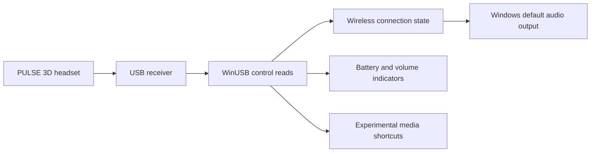

# Architecture and observed protocol

A WinForms window and tray icons share a background reader. A mutex limits the application to one instance per session; an event brings its window forward when the launcher is opened again.

## USB identity and transport

| Field | Value |
| --- | --- |
| VID / PID | `054C / 0D5E` |
| Control interface | `MI_03`, WinUSB |
| Reference audio interface | `MI_00`, USBAudio |
| Observed interrupt input | `83`, maximum packet size 32 |
| Control request | `bmRequestType A1`, `bRequest 01`, `wValue 03B0`, `wIndex 0003` |
| Requested / observed length | 65 / 8 bytes |

Devices are discovered by USB identity and registered interfaces, without an embedded instance path or machine-specific GUID.

Example connected/muted state: `B0 03 64 64 EF 5A 11 3C`.

| Byte index | Observed field | Use |
| --- | --- | --- |
| 0 | `B0` header | Validate before decoding |
| 1 | Unmapped | Not used |
| 2 | Chat/game balance, 0–100 | Experimental track changes from balance differences |
| 3 | Battery, 0–100 | Receiver percentage; accuracy pending |
| 4 | Connection bit `04`; mute bit `02` | Connection independently of mute |
| 5 | Report reason/state | `13` after GAME, `14` after CHAT; other values unmapped |
| 6 | Unmapped, commonly `11` | Not used |
| 7 | Hardware volume, 0–100 | Dashboard and temporary overlay |

Byte 4 states `EF` / `ED` indicate connected with / without microphone mute. `EB` / `E3` were observed with the headset off while the receiver remained connected. Byte 5 alone must not determine connection. A reconnect report such as `B0 FF FF FF E1 00 11 FF` is transitional; `FF` is not a percentage.

## Routing and indicators

Connection must match for three consecutive reads. The nominal interval is 250 ms; USB operations and device enumeration add latency. Missing headset audio output supports receiver-unavailable detection. A read error while the audio endpoint still exists keeps an unknown state and preserves the current output. Default selection uses `IPolicyConfig.SetDefaultEndpoint` for all three output roles. Microphone input is not switched.

Only valid connected readings update battery history. Volume changes display a focus-free overlay for about 1.8 seconds. First readings, reconnections and invalid volume values do not create volume notifications.

## Media buttons

CHAT/GAME decoding combines balance changes with observed reason codes. Identical B0 snapshots do not prove another press at a balance limit. The receiver HID descriptor also declares consumer report `01`: byte 2 bits 0/1/2 represent previous/play-pause/next. The decoder accepts press edges from actual interrupt packets; that support has been tested with simulated data.

In the physical test on 2026-09-30, GAME at maximum, CHAT presses and OFF/MONITOR changes were monitored with mute off. Across 9,621 state queries over five minutes, interrupt IN 83 returned zero packets. CHAT changed balance from 100 to 60. GAME at the limit and OFF/MONITOR provided no separate usable signal. A declared play/pause usage does not prove that MONITOR transmits it.

`SendInput` sends supported Windows media keys. Initialization, reconnection, battery updates, mute and volume changes must not trigger track commands.

References are listed in [Third-party references](../THIRD_PARTY_NOTICES.md).

## Automatic balance recentering investigation

The HID descriptor declares vendor output report `B1` with one 8-bit payload byte. Its meaning is unknown; the descriptor alone does not establish a writable balance control.

Isolated USB tests on 2026-09-30 paused the application and restarted it afterwards. Only the scratch research tools sent writes; the distributed application remains read-only.

| Request on interface 03 | Result | Observed balance |
| --- | --- | --- |
| GET_REPORT Output B1 | Rejected, Windows error 31 | Unchanged |
| SET_REPORT Output B1, payload `B1 32` | Rejected, error 31 | 100 before and after |
| SET_REPORT Output B1, payload `32` | Rejected, error 31 | 90 before and after |
| SET_REPORT Feature B1, payload `B1 32` | Accepted, 2 bytes transferred | 90 before and after |
| SET_REPORT Feature B1, payload `32` | Rejected, error 31 | 90 before and after |
| SET_REPORT Feature B0, valid connected snapshot with only byte 2 changed to 50 | Rejected, error 31 | 90 before and after |

Here `32` is hexadecimal for decimal 50. Eight reads at 250 ms intervals followed each write. The change from 100 to 90 occurred between tests, before the second write, and cannot be attributed to a command. Accepted USB transfer status is insufficient to validate a command: the Feature B1 test did not recenter the balance.

GET_REPORT Feature B1 returned a truncated B0 response, while Feature A0 returned a B0 header with unrelated trailing bytes. These mismatched responses were discarded as evidence of their requested report semantics.

Automatic recentering is not implemented. Further work needs a verified command or independent button events, ideally from a captured console USB session. A software-only change to the decoder baseline cannot change the physical balance or recover presses at a saturated limit. The independent [PULSE 3D telemetry implementation](https://github.com/promanski/pulse3d-ksystemstats) also provides read-only status access.

### Follow-up transport investigation

The complete 324-byte configuration descriptor was read from this receiver. It contains four interfaces: audio control 0, microphone streaming 1, speaker streaming 2, and HID 3. The audio control topology has input/output terminals and Feature Units 2 and 3. Both advertise master control bitmap `03`, meaning mute and volume according to [USB Audio Class 1.0](https://www.usb.org/sites/default/files/audio10.pdf). There is no declared Mixer, Selector, Processing or Extension Unit, and no separate standard game/chat control. This rules out an advertised USB Audio mixer control as the recentering mechanism; it does not rule out an undocumented vendor command.

The HID interface has only interrupt IN `83`, maximum packet size 32. GET_PROTOCOL, GET_IDLE for B0, GET_REPORT Input 01 with its full five-byte length, and GET_REPORT Input B0 with its eight-byte length were rejected with error 31. SET_IDLE for B0 with a four-millisecond duration was also rejected. Rejection of optional HID requests alone is not proof of a device fault.

A separate 45-second diagnostic set a 20 ms interrupt timeout and alternated buffer sizes, preserving the exact WinUSB error instead of collapsing all failures to a null reading. The operator exercised both buttons through the full balance range. B0 reads showed changes up to 100 and down to 0. The interrupt endpoint produced zero packets:

| Requested buffer | Attempts | Result |
| --- | --- | --- |
| 8 bytes | 363 | Timeout, Windows error 121 |
| 32 bytes | 362 | Timeout, error 121 |
| 64 bytes | 362 | Timeout, error 121 |
| 256 bytes | 362 | Timeout, error 121 |

This test did not reveal stalled transfers, a required buffer size, oversized input packets, or independent limit-press events. It cannot establish how every firmware version behaves.

Source comparisons inspected HeadsetControl commit `25dadae5c5b834f94ee954513421def12c5d6305` and the [Gold/Platinum Linux driver](https://github.com/counter185/hid-playstation-headset) commit `56e02eefd52e6ac72d3511d8d1aa67735e84b0ce`. HeadsetControl has no PULSE 3D implementation; its INZONE H5 uses different report IDs and a vendor HCI envelope. The Gold/Platinum driver reads B0 but supplies no balance setter. [PlayStation Link research](https://github.com/Jprnp/pslink-dossier) describes a different receiver and 64-byte B0 / D0 controls; those writes were not applied to this PULSE 3D.

Decision: automatic balance recentering, including a return to 90%, is excluded from the current preview. Existing experimental shortcuts still work only when physical balance changes. Revisit this only with a verified PULSE 3D command or an independent event source. Research executables and speculative writes are excluded from the package and production code.

### Explicit 100-to-90 test

The operator set GAME to its limit and confirmed a 100% balance before the test. Four consecutive B0 reads verified the initial state `B0 04 64 64 ED 13 11 50`. The application was paused throughout the writes and restarted afterwards.

| Candidate command, target decimal 90 | USB result | Twelve subsequent reads at 250 ms intervals |
| --- | --- | --- |
| SET_REPORT Feature B1 (`wValue 03B1`), payload `B1 5A` | Accepted, 2 bytes transferred | Balance remained 100% |
| SET_REPORT Output B1 (`wValue 02B1`), payload `B1 5A` | Rejected, error 31 | Balance remained 100% |
| SET_REPORT Input B0 (`wValue 01B0`), connected snapshot with byte 2 set to `5A` | Rejected, error 31 | Balance remained 100% |

All 36 post-write status reads matched the original eight-byte state, including connection, microphone mute, battery and hardware volume. This specifically tests a target of 90%, unlike the earlier attempts targeting 50%. No functional balance adjustment command was established.
