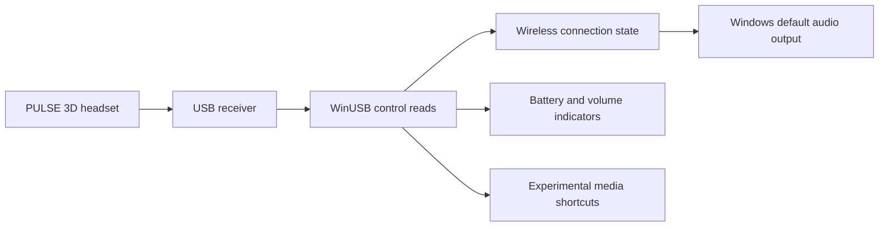

# Architecture and observed protocol

A WinForms window and tray icons share a background reader. A mutex limits the application to one instance per session; an event brings its window forward when the launcher is opened again.

## USB identity and transport

| Field | Value |
| --- | --- |
| VID / PID | `054C / 0D5E` |
| Control interface | `MI_03`, WinUSB |
| Reference audio interface | `MI_00`, USBAudio |
| Observed interrupt input | `83`, maximum packet size 32 |
| Control request | `bmRequestType A1`, `bRequest 01`, `wValue 03B0`, `wIndex 0003` |
| Requested / observed length | 65 / 8 bytes |

Devices are discovered by USB identity and registered interfaces, without an embedded instance path or machine-specific GUID.

Example connected/muted state: `B0 03 64 64 EF 5A 11 3C`.

| Byte index | Observed field | Use |
| --- | --- | --- |
| 0 | `B0` header | Validate before decoding |
| 1 | Unmapped | Not used |
| 2 | Chat/game balance, 0–100 | Experimental track changes from balance differences |
| 3 | Battery, 0–100 | Receiver percentage; accuracy pending |
| 4 | Connection bit `04`; mute bit `02` | Connection independently of mute |
| 5 | Report reason/state | `13` after GAME, `14` after CHAT; other values unmapped |
| 6 | Unmapped, commonly `11` | Not used |
| 7 | Hardware volume, 0–100 | Dashboard and temporary overlay |

Byte 4 states `EF` / `ED` indicate connected with / without microphone mute. `EB` / `E3` were observed with the headset off while the receiver remained connected. Byte 5 alone must not determine connection. A reconnect report such as `B0 FF FF FF E1 00 11 FF` is transitional; `FF` is not a percentage.

## Routing and indicators

Connection must match for three consecutive reads. The nominal interval is 250 ms; USB operations and device enumeration add latency. Missing headset audio output supports receiver-unavailable detection. A read error while the audio endpoint still exists keeps an unknown state and preserves the current output. Default selection uses `IPolicyConfig.SetDefaultEndpoint` for all three output roles. Microphone input is not switched.

Only valid connected readings update battery history. Volume changes display a focus-free overlay for about 1.8 seconds. First readings, reconnections and invalid volume values do not create volume notifications.

## Media buttons

CHAT/GAME decoding combines balance changes with observed reason codes. Identical B0 snapshots do not prove another press at a balance limit. The receiver HID descriptor also declares consumer report `01`: byte 2 bits 0/1/2 represent previous/play-pause/next. The decoder accepts press edges from actual interrupt packets; that support has been tested with simulated data.

In the physical test on 2026-09-30, GAME at maximum, CHAT presses and OFF/MONITOR changes were monitored with mute off. Across 9,621 state queries over five minutes, interrupt IN 83 returned zero packets. CHAT changed balance from 100 to 60. GAME at the limit and OFF/MONITOR provided no separate usable signal. A declared play/pause usage does not prove that MONITOR transmits it.

`SendInput` sends supported Windows media keys. Initialization, reconnection, battery updates, mute and volume changes must not trigger track commands.

References are listed in [Third-party references](../THIRD_PARTY_NOTICES.md).
